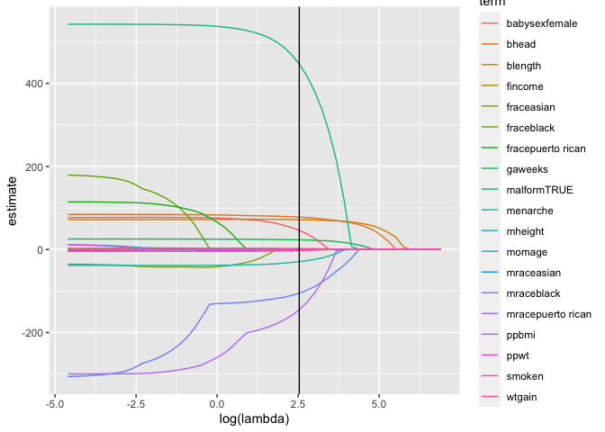
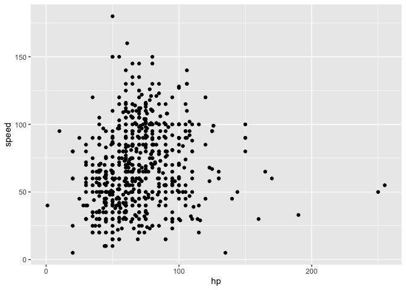

Statistical Learning
================
Ruilian Zhang
12/2/2021

``` r
library(tidyverse)
```

    ## ── Attaching packages ─────────────────────────────────────── tidyverse 1.3.1 ──

    ## ✓ ggplot2 3.3.5     ✓ purrr   0.3.4
    ## ✓ tibble  3.1.4     ✓ dplyr   1.0.7
    ## ✓ tidyr   1.1.3     ✓ stringr 1.4.0
    ## ✓ readr   2.0.1     ✓ forcats 0.5.1

    ## ── Conflicts ────────────────────────────────────────── tidyverse_conflicts() ──
    ## x dplyr::filter() masks stats::filter()
    ## x dplyr::lag()    masks stats::lag()

``` r
library(glmnet)
```

    ## Loading required package: Matrix

    ## 
    ## Attaching package: 'Matrix'

    ## The following objects are masked from 'package:tidyr':
    ## 
    ##     expand, pack, unpack

    ## Loaded glmnet 4.1-3

``` r
set.seed(11)
```

## Lasso

Predicting bwt

``` r
bwt_df = 
  read_csv("data/birthweight.csv") %>% 
  janitor::clean_names() %>%
  mutate(
    babysex = as.factor(babysex),
    babysex = fct_recode(babysex, "male" = "1", "female" = "2"),
    frace = as.factor(frace),
    frace = fct_recode(frace, "white" = "1", "black" = "2", "asian" = "3", 
                       "puerto rican" = "4", "other" = "8"),
    malform = as.logical(malform),
    mrace = as.factor(mrace),
    mrace = fct_recode(mrace, "white" = "1", "black" = "2", "asian" = "3", 
                       "puerto rican" = "4")) %>% 
  sample_n(200)
```

    ## Rows: 4342 Columns: 20

    ## ── Column specification ────────────────────────────────────────────────────────
    ## Delimiter: ","
    ## dbl (20): babysex, bhead, blength, bwt, delwt, fincome, frace, gaweeks, malf...

    ## 
    ## ℹ Use `spec()` to retrieve the full column specification for this data.
    ## ℹ Specify the column types or set `show_col_types = FALSE` to quiet this message.

``` r
y = bwt_df %>% pull(bwt)
x = model.matrix(bwt ~ ., bwt_df)[, -1] # get rib of first column of intercept
```

``` r
lambda_grid = 10 ^ seq(3, -2, by = -0.1) # pre-specify lambda

lasso_fit = glmnet(x, y, lambda = lambda_grid)

lasso_cv = cv.glmnet(x, y, lambda = lambda_grid)

lambda_opt = lasso_cv$lambda.min
```

``` r
lasso_fit %>% 
  broom::tidy() %>% 
  complete(term, lambda, fill = list(estimate = 0)) %>% 
  filter(term != "(Intercept)") %>% 
  ggplot(aes(x = log(lambda), y = estimate, group = term, color = term)) +
  geom_path() +
  geom_vline(xintercept = log(lambda_opt))
```

<!-- -->

## Cluster pokemons

``` r
pokemon_df = 
  read_csv("data/pokemon.csv") %>% 
  janitor::clean_names() %>% 
  select(speed, hp)
```

    ## Rows: 800 Columns: 13

    ## ── Column specification ────────────────────────────────────────────────────────
    ## Delimiter: ","
    ## chr (3): Name, Type 1, Type 2
    ## dbl (9): #, Total, HP, Attack, Defense, Sp. Atk, Sp. Def, Speed, Generation
    ## lgl (1): Legendary

    ## 
    ## ℹ Use `spec()` to retrieve the full column specification for this data.
    ## ℹ Specify the column types or set `show_col_types = FALSE` to quiet this message.

``` r
pokemon_df %>% 
  ggplot(aes(x = hp, y = speed)) +
  geom_point()
```

<!-- -->

Use K-means to identify clusters

``` r
kmeans_fit = 
  kmeans(x = pokemon_df, centers = 3)
```

``` r
pokemon_df %>% 
  broom::augment(kmeans_fit, .) %>% # model first, df second
  ggplot(aes(x = hp, y = speed, color = .cluster)) +
  geom_point()
```

<!-- -->
